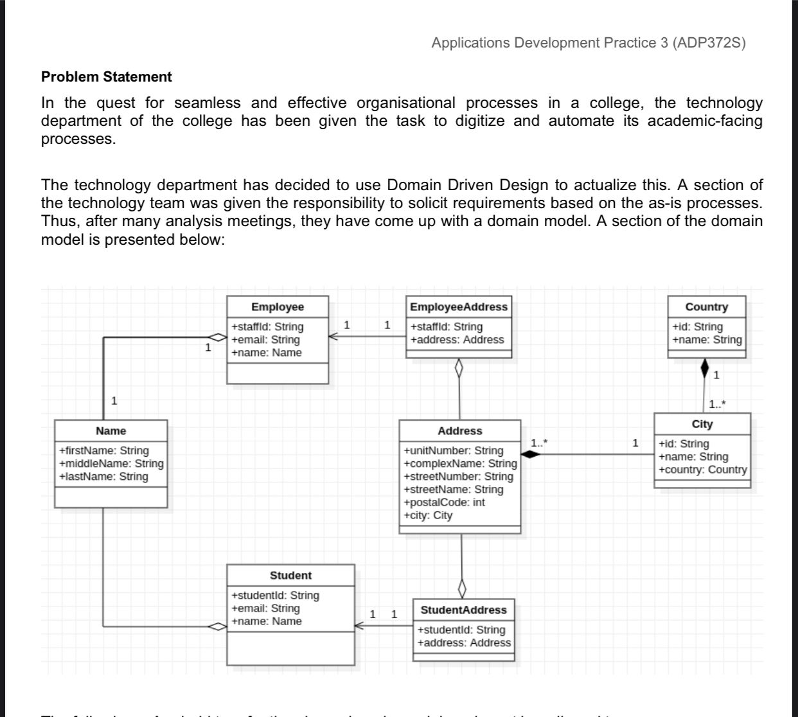

#School Management 

#UML part and Problem Satement

#Group 6 will be implementing this project 

Question 10

Security layer
One apparent flaw that is in the implementation of the project is lack of a security layer. This is important since the user will be required to enter some confidential information ( Names, address, etc.).

Changing to meet requirements
The way the project had to implemented, was too linear. This means that it could only go in one direction and one step had to completed before the next one could be done. This is not good project management since this makes it difficult to go back an

There should be an update and create method in case the collage technology department has to make some changes.
On the UML diagram attributes are public instead of being private,there Is not specification on primary keys of each entity.
